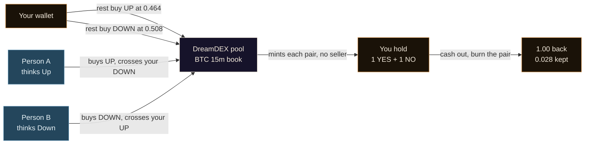
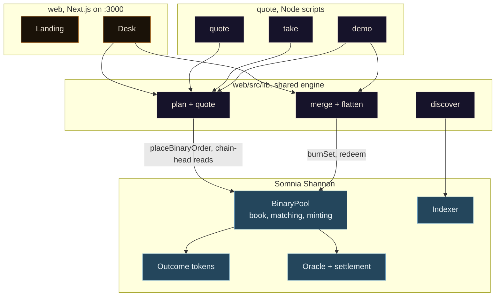
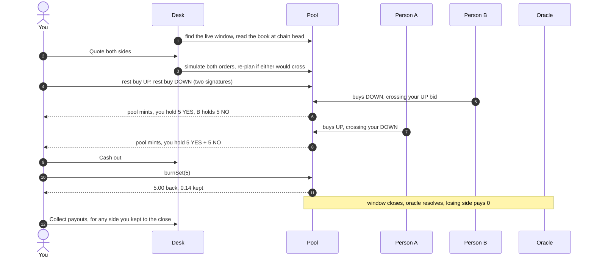

<div align="center">


# HOUSE

**Be the book. Quote both sides of a DreamDEX window from a normal wallet.**

Post two prices, wait for takers, keep the gap. No side to pick, no tokens to start, no vault in between.

Live at [bethebook.xyz](https://bethebook.xyz), desk at [bethebook.xyz/desk](https://bethebook.xyz/desk).

[](https://docs.somnia.network/)
[](https://dorahacks.io/hackathon/event-contracts/detail)
[](https://www.npmjs.com/package/@somnia-chain/markets-sdk)
[](https://shannon-explorer.somnia.network/tx/0xed699ecef467211225f8c333588ac16aef09424809b080bd62665b018c97c4a1)

</div>

---

DreamDEX Event Contracts are short binaries on BTC and ETH, five minutes to a day, settled on Somnia. Every product built on them so far is a taker: pick Up or Down, hope. HOUSE is the other seat. It rests a buy on each side of the book at once, one tick better than the crowd. When someone crosses either price the pool mints a fresh YES and NO pair with no seller involved, and after both cross you hold a complete pair that is worth exactly 1.00 whatever BTC does. You paid less than 1.00 for it. Cash out hands the pair back to the pool for the full 1.00 and the difference is yours.

## The problem

DreamDEX has thin books. Its one unusual rule, that two opposite buyers can cross without a seller because the pool mints the pair, means a market maker on these windows needs no inventory at all. Nobody had put that seat in front of a person with a wallet. The only way to be the book was to run a bot from a kit, read the SDK, and think in ticks.

HOUSE turns it into one button and a wallet signature. The quotes are real orders in DreamDEX's own book. The matching, the minting and the settlement are DreamDEX's. HOUSE holds nothing of yours.

## What you get

| On the desk | What it does |
|---|---|
| **Quote both sides** | Rests a buy for UP and a buy for DOWN, one tick inside the market, sized as you set. Both orders are simulated against the pool before anything is signed, and the second again right before its own send, so a quote that would cross is re-planned instead of sent. Two signatures. A pool you have never used adds one approval, resting quotes add one batch cancel. |
| **Cash out** | Cancels resting quotes, hands every YES and NO pair back to the pool for 1.00 each, sells any unmatched leftover at the market. |
| **Collect payouts** | Redeems winning tokens from windows that already settled. |
| **Take down** | Cancels your resting prices, in one batch transaction. |
| **Market picker** | All ten DreamDEX markets, BTC and ETH at 5m, 15m, 1h, 4h and 1d. The choice lives in the URL, so `/desk?m=eth-1h` opens straight onto ETH, 1 hour. Default is BTC 15m. |
| **`/desk?watch=0x…`** | Follows any wallet read-only. How to watch the Node quoter, or show a judge. |

The same engine runs unattended from Node as `npm run quote`, and `npm run demo` plays the whole loop with a second wallet as the taker.

## The pair



- Prices are probabilities. UP at 0.464 and DOWN at 0.508 add to 0.972, and a pair pays exactly 1.00.
- Both orders are PostOnly with a mandatory expiry, so they rest, never take, and die on their own.
- If only one side fills you hold a plain position. The desk shows it as unmatched and Cash out sells it.

## System



Reads that must be current come from the chain, not the indexer: the book, your resting orders, your balances. The indexer only finds the live window.

## End-to-end



## Proof on Shannon

`npm run demo` on 2 Sep 2026, BTC 15m market `0x…11199`, five contracts a side. HOUSE rested UP at 0.036 and DOWN at 0.945, so a pair cost 0.981.

| Step | Transaction |
|---|---|
| Taker buys UP against HOUSE's DOWN, pool mints | [`0x76f7…b77a2`](https://shannon-explorer.somnia.network/tx/0x76f7625ce7fa6c1264fbbe752d1d2a6a5a064cc871706eb56028fa63c2bb77a2) |
| Taker buys DOWN against HOUSE's UP, pool mints again | [`0xcb58…888db`](https://shannon-explorer.somnia.network/tx/0xcb589ed80a98999a8a82e51f102475df97d8e5731f71df8d1e8d51f87e1888db) |
| Five pairs merged back to collateral | [`0xed69…97c4a1`](https://shannon-explorer.somnia.network/tx/0xed699ecef467211225f8c333588ac16aef09424809b080bd62665b018c97c4a1) |
| Collateral change | +0.095 tUSDC, five times the 0.019 spread |

Earlier that day a third party bot crossed a resting HOUSE quote on its own, [`0x1429…41af0`](https://shannon-explorer.somnia.network/tx/0x14295dd86137d448411d864635743a59796df5f284e595879f70109268941af0), which the indexer records as MINT_A_PAIR with HOUSE as maker. Nobody had to be told the book was there.

## Repository layout

```
house/
├─ web/                 Next.js 15 app
│  └─ src/
│     ├─ app/           / landing, /desk, /demo/logo, icon
│     ├─ components/    Landing, HeroWindow, HowItWorks, Floor, HouseDesk, logo marks
│     └─ lib/           config, discover, quoting math, house (plan, quote, merge, flatten, redeem)
├─ quote/
│  └─ src/              quote (maker loop), take (demo taker), flatten, demo (whole loop), env
├─ SDK-FEEDBACK.md      what we hit in markets-sdk 0.29.0 and what we would change
└─ .env.example         PRIVATE_KEY for the maker, TAKER_KEY for the demo taker
```

## Stack

| Layer | What |
|---|---|
| **Web** | Next.js 15, React 19, wagmi + viem, GSAP, Lenis |
| **Engine** | `@somnia-chain/markets-sdk` 0.29.0, unified chain-head reads and PostOnly writes |
| **Venue** | DreamDEX BinaryPool, BTC and ETH, 5m to 1d windows, venue `0x6797…a28c` |
| **Chain** | Somnia Shannon, chainId 50312, tUSDC collateral |
| **Scripts** | Node 22, tsx |

No Solidity, no vault, no custody. Every write is a DreamDEX order or settlement call signed by your wallet.

## On Shannon

| Contract | Address |
|---|---|
| BinaryMarketsModule | `0x3ecC694Cef705358864a646142ac17A90E29e388` |
| BinarySettlement | `0xbF4a49e0Dfd092e5FBE8E5761064C49533e6Ed23` |
| OutcomeToken6909 | `0xB52c5934113Af5c0Bb20eb3C72290C8215f755b9` |
| OracleHub | `0xe40db387cC98601Dd11bd634fF2f3AD5686dE32b` |
| tUSDC collateral | `0x70a86D8842FB63C4Ad2b7cdddF530eBf1BB25d8E` |
| DreamDEX venue id | `0x679795a0195a1b76cdebb7c51d74e058aee92919b8c3389af86ef24535e8a28c` |

HOUSE deploys nothing. These are DreamDEX's contracts, reached through the SDK.

What the SDK got right and what cost us time is in [SDK-FEEDBACK.md](SDK-FEEDBACK.md).

## Getting started

Root `.env` holds `PRIVATE_KEY` for the maker scripts and `TAKER_KEY` for the demo taker. Both wallets need STT for gas, since the SDK reserves a 0.6 STT envelope per write, and tUSDC, which `npm run take -- --faucet` mints.

```bash
npm install
npm run dev            # landing on :3000, desk on :3000/desk
```

| Command | Does |
|---|---|
| `npm run quote` | Maker loop. Requotes about every 20s, one tick inside the market. `HOUSE_HALF_SPREAD` and `HOUSE_SIZE` tune it. `--once` places one quote and exits. |
| `npm run take` | Demo taker. Crosses both resting quotes. `--dry` plans only, `--faucet` mints tUSDC first, `--faucet-only` stops there. |
| `npm run flatten` | Maker cash out from Node. `--dry` prints inventory and collateral. |
| `npm run demo` | The whole loop in one process. Rounds until the maker holds a pair, then flattens. `--keep` leaves the pair in the wallet so the desk can show it. |

`HOUSE_MARKET=eth-1h` points any of them at another market, same keys as the desk URL. Default BTC 15m.

Deploys to Vercel from `web` with default settings. Set `NEXT_PUBLIC_SITE_URL` to the public origin. Logo options and the 1024 submission asset are at `/demo/logo`.

---

<div align="center">
<sub>HOUSE, a wallet that is the book.</sub>
</div>
